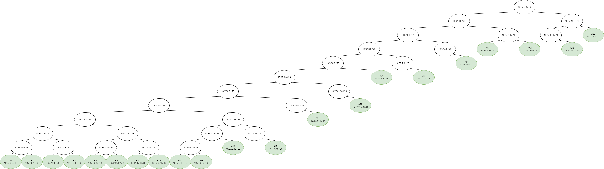
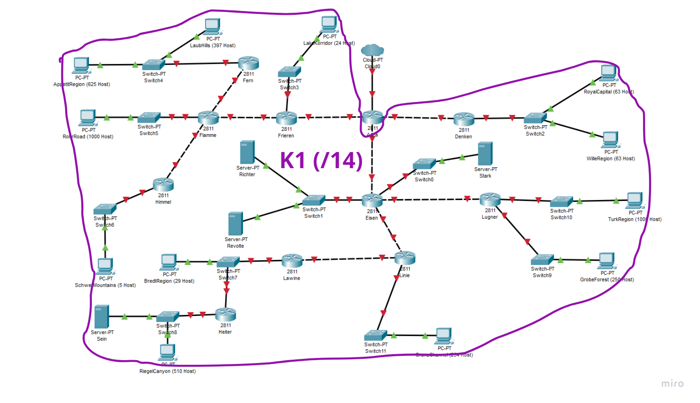

# Jarkom-Modul-4-E01-2023

## Subnet

Berikut adalah pembagian nama subnet:<br>


## VLSM (GNS3)

### Perhitungan IP

Jumlah total host yang ada pada topology yang diberikan adalah adalah `4255`, dengan perhitungan yang dapat dilihat pada [sheet - 0](https://docs.google.com/spreadsheets/d/1id21t5bIO7L2ZROfAFJeaZ7IrfyEOFFj/edit#gid=4654553) 

Sehingga subnet terkecil yang dapat menampung total ip tersebut adalah `/19` dengan kapasitas `8190`

Berikut adalah tree yang didapatkan:<br>



Dari tree datas, dapat dilakukan pembagian ip sebagai berikut:<br>

<br>
_sumber: [sheet - 1](https://docs.google.com/spreadsheets/d/1id21t5bIO7L2ZROfAFJeaZ7IrfyEOFFj/edit#gid=847106198)_

### Penerapan

Berikut adalah network config untuk setiap node:

* Aura
```bash
auto eth0
iface eth0 inet dhcp

#A1
auto eth1
iface eth1 inet static
	address 10.37.0.1
	netmask 255.255.255.252

#A3
auto eth2
iface eth2 inet static
	address 10.37.0.5
	netmask 255.255.255.252

#A14
auto eth3
iface eth3 inet static
	address 10.37.0.25
	netmask 255.255.255.252

up iptables -t nat -A POSTROUTING -o eth0 -j MASQUERADE -s 10.37.0.0/19
```
<br>

* Denken
```bash
#A1
auto eth0
iface eth0 inet static
	address 10.37.0.2
	netmask 255.255.255.252
	gateway 10.37.0.1

#A2
auto eth1
iface eth1 inet static
	address 10.37.1.1
	netmask 255.255.255.0

up echo "nameserver 192.168.122.1" > /etc/resolv.conf
```
<br>

* Eisen
```bash
#A3
auto eth0
iface eth0 inet static
	address 10.37.0.6
	netmask 255.255.255.252
	gateway 10.37.0.5

#A4
auto eth1
iface eth1 inet static
	address 10.37.0.9
	netmask 255.255.255.252

#A5
auto eth2
iface eth2 inet static
	address 10.37.0.13
	netmask 255.255.255.252

#A8
auto eth3
iface eth3 inet static
	address 10.37.0.17
	netmask 255.255.255.252

#A13
auto eth4
iface eth4 inet static
	address 10.37.0.41
	netmask 255.255.255.248

up echo "nameserver 192.168.122.1" > /etc/resolv.conf
```
<br>

* Frieren
```bash
#A14
auto eth0
iface eth0 inet static
	address 10.37.0.26
	netmask 255.255.255.252
	gateway 10.37.0.25

#A15
auto eth1
iface eth1 inet static
	address 10.37.0.29
	netmask 255.255.255.252

#A21
auto eth2
iface eth2 inet static
	address 10.37.0.65
	netmask 255.255.255.224

up echo "nameserver 192.168.122.1" > /etc/resolv.conf
```
<br>

* RoyalCapital
```bash
#A2
auto eth0
iface eth0 inet static
	address 10.37.1.2
	netmask 255.255.255.0
	gateway 10.37.1.1

up echo "nameserver 192.168.122.1" > /etc/resolv.conf
```
<br>

* WilleRegion
```bash
#A2
auto eth0
iface eth0 inet static
	address 10.37.1.3
	netmask 255.255.255.0
	gateway 10.37.1.1

up echo "nameserver 192.168.122.1" > /etc/resolv.conf
```
<br>

* Stark
```bash
#A4
auto eth0
iface eth0 inet static
	address 10.37.0.10
	netmask 255.255.255.252
	gateway 10.37.0.9

up echo "nameserver 192.168.122.1" > /etc/resolv.conf
```
<br>

* Lugner
```bash
#A5
auto eth0
iface eth0 inet static
	address 10.37.0.14
	netmask 255.255.255.252
	gateway 10.37.0.13

#A6
auto eth1
iface eth1 inet static
	address 10.37.8.1
	netmask 255.255.252.0

#A7
auto eth2
iface eth2 inet static
	address 10.37.2.1
	netmask 255.255.255.0

up echo "nameserver 192.168.122.1" > /etc/resolv.conf
```
<br>

* TurkRegion
```bash
#A6
auto eth0
iface eth0 inet static
	address 10.37.8.2
	netmask 255.255.252.0
	gateway 10.37.8.1

up echo "nameserver 192.168.122.1" > /etc/resolv.conf
```
<br>

* GrobeForest
```bash
#A7
auto eth0
iface eth0 inet static
	address 10.37.2.2
	netmask 255.255.255.0
	gateway 10.37.2.1

up echo "nameserver 192.168.122.1" > /etc/resolv.conf
```
<br>

* Linie
```bash
#A8
auto eth0
iface eth0 inet static
	address 10.37.0.18
	netmask 255.255.255.252
	gateway 10.37.0.17

#A9
auto eth1
iface eth1 inet static
	address 10.37.4.1
	netmask 255.255.254.0

#A10
auto eth2
iface eth2 inet static
	address 10.37.0.21
	netmask 255.255.255.252

up echo "nameserver 192.168.122.1" > /etc/resolv.conf
```
<br>

* GranzChannel
```bash
#A9
auto eth0
iface eth0 inet static
	address 10.37.4.2
	netmask 255.255.254.0
	gateway 10.37.4.1

up echo "nameserver 192.168.122.1" > /etc/resolv.conf
```
<br>

* Lawine
```bash
#A10
auto eth0
iface eth0 inet static
	address 10.37.0.22
	netmask 255.255.255.252
	gateway 10.37.0.21

#A11
auto eth1
iface eth1 inet static
	address 10.37.0.129
	netmask 255.255.255.192

up echo "nameserver 192.168.122.1" > /etc/resolv.conf
```
<br>

* Helter
```bash
#A11
auto eth0
iface eth0 inet static
	address 10.37.0.130
	netmask 255.255.255.192
	gateway 10.37.0.129

#A12
auto eth1
iface eth1 inet static
	address 10.37.12.1
	netmask 255.255.252.0

up echo "nameserver 192.168.122.1" > /etc/resolv.conf
```
<br>

* BredtRegion
```bash
#A11
auto eth0
iface eth0 inet static
	address 10.37.0.131
	netmask 255.255.255.192
	gateway 10.37.0.129

up echo "nameserver 192.168.122.1" > /etc/resolv.conf
```
<br>

* RiegelCanyon
```bash
#A12
auto eth0
iface eth0 inet static
	address 10.37.12.2
	netmask 255.255.252.0
	gateway 10.37.12.1

up echo "nameserver 192.168.122.1" > /etc/resolv.conf
```
<br>

* Sein
```bash
#A12
auto eth0
iface eth0 inet static
	address 10.37.12.3
	netmask 255.255.252.0
	gateway 10.37.12.1

up echo "nameserver 192.168.122.1" > /etc/resolv.conf
```
<br>

* Revolte
```bash
#A13
auto eth0
iface eth0 inet static
	address 10.37.0.42
	netmask 255.255.255.248
	gateway 10.37.0.41

up echo "nameserver 192.168.122.1" > /etc/resolv.conf
```
<br>

* Richter
```bash
#A13
auto eth0
iface eth0 inet static
	address 10.37.0.43
	netmask 255.255.255.248
	gateway 10.37.0.41

up echo "nameserver 192.168.122.1" > /etc/resolv.conf
```
<br>

* Flamme
```bash
#A15
auto eth0
iface eth0 inet static
	address 10.37.0.30
	netmask 255.255.255.252
	gateway 10.37.0.29

#A16
auto eth1
iface eth1 inet static
	address 10.37.0.33
	netmask 255.255.255.252

#A18
auto eth2
iface eth2 inet static
	address 10.37.16.1
	netmask 255.255.252.0

#A19
auto eth3
iface eth3 inet static
	address 10.37.0.37
	netmask 255.255.255.252

up echo "nameserver 192.168.122.1" > /etc/resolv.conf
```
<br>

* Himmel
```bash
#A16
auto eth0
iface eth0 inet static
	address 10.37.0.34
	netmask 255.255.255.252
	gateway 10.37.0.33

#A17
auto eth1
iface eth1 inet static
	address 10.37.0.49
	netmask 255.255.255.248

up echo "nameserver 192.168.122.1" > /etc/resolv.conf
```
<br>

* SchwerMountains
```bash
#A17
auto eth0
iface eth0 inet static
	address 10.37.0.50
	netmask 255.255.255.248
	gateway 10.37.0.49

up echo "nameserver 192.168.122.1" > /etc/resolv.conf
```
<br>

* RohrRoad
```bash
#A18
auto eth0
iface eth0 inet static
	address 10.37.16.2
	netmask 255.255.252.0
	gateway 10.37.16.1

up echo "nameserver 192.168.122.1" > /etc/resolv.conf
```
<br>

* Fern
```bash
#A19
auto eth0
iface eth0 inet static
	address 10.37.0.38
	netmask 255.255.255.252
	gateway 10.37.0.37

#A20
auto eth1
iface eth1 inet static
	address 10.37.24.1
	netmask 255.255.248.0

up echo "nameserver 192.168.122.1" > /etc/resolv.conf
```
<br>

* AppetitRegion
```bash
#A20
auto eth0
iface eth0 inet static
	address 10.37.24.2
	netmask 255.255.248.0
	gateway 10.37.24.1

up echo "nameserver 192.168.122.1" > /etc/resolv.conf
```
<br>

* LaubHills
```bash
#A20
auto eth0
iface eth0 inet static
	address 10.37.24.3
	netmask 255.255.248.0
	gateway 10.37.24.1

up echo "nameserver 192.168.122.1" > /etc/resolv.conf
```
<br>

* LakeKorridor
```bash
#A21
auto eth0
iface eth0 inet static
	address 10.37.0.66
	netmask 255.255.255.224
	gateway 10.37.0.65

up echo "nameserver 192.168.122.1" > /etc/resolv.conf
```
<br>

Berikut adalah konfigurasi routing yang diperlukan:

* Aura
```bash
#A21
route add -net 10.37.0.64 netmask 255.255.255.224 gw 10.37.0.26
#A20
route add -net 10.37.24.0 netmask 255.255.248.0 gw 10.37.0.26
#A19
route add -net 10.37.0.36 netmask 255.255.255.252 gw 10.37.0.26
#A18
route add -net 10.37.16.0 netmask 255.255.252.0 gw 10.37.0.26
#A17
route add -net 10.37.0.48 netmask 255.255.255.248 gw 10.37.0.26
#A16
route add -net 10.37.0.32 netmask 255.255.255.252 gw 10.37.0.26
#A15
route add -net 10.37.0.28 netmask 255.255.255.252 gw 10.37.0.26
#A13
route add -net 10.37.0.40 netmask 255.255.255.248 gw 10.37.0.6
#A12
route add -net 10.37.12.0 netmask 255.255.252.0 gw 10.37.0.6
#A11
route add -net 10.37.0.128 netmask 255.255.255.192 gw 10.37.0.6
#A10
route add -net 10.37.0.20 netmask 255.255.255.252 gw 10.37.0.6
#A9
route add -net 10.37.4.0 netmask 255.255.254.0 gw 10.37.0.6
#A8
route add -net 10.37.0.16 netmask 255.255.255.252 gw 10.37.0.6
#A7
route add -net 10.37.2.0 netmask 255.255.255.0 gw 10.37.0.6
#A6
route add -net 10.37.8.0 netmask 255.255.252.0 gw 10.37.0.6
#A5
route add -net 10.37.0.12 netmask 255.255.255.252 gw 10.37.0.6
#A4
route add -net 10.37.0.8 netmask 255.255.255.252 gw 10.37.0.6
#A2
route add -net 10.37.1.0 netmask 255.255.255.0 gw 10.37.0.2
```
<br>

* Eisen
```bash
#A12
route add -net 10.37.12.0 netmask 255.255.252.0 gw 10.37.0.18
#A11
route add -net 10.37.0.128 netmask 255.255.255.192 gw 10.37.0.18
#A10
route add -net 10.37.0.20 netmask 255.255.255.252 gw 10.37.0.18
#A9
route add -net 10.37.4.0 netmask 255.255.254.0 gw 10.37.0.18
#A7
route add -net 10.37.2.0 netmask 255.255.255.0 gw 10.37.0.14
#A6
route add -net 10.37.8.0 netmask 255.255.252.0 gw 10.37.0.14
```
<br>

* Linie
```bash
#A12
route add -net 10.37.12.0 netmask 255.255.252.0 gw 10.37.0.22
#A11
route add -net 10.37.0.128 netmask 255.255.255.192 gw 10.37.0.22
```
<br>

* Lawine
```bash
#A12
route add -net 10.37.12.0 netmask 255.255.252.0 gw 10.37.0.130
```
<br>

* Frieren
```bash
#A20
route add -net 10.37.24.0 netmask 255.255.248.0 gw 10.37.0.30
#A19
route add -net 10.37.0.36 netmask 255.255.255.252 gw 10.37.0.30
#A18
route add -net 10.37.16.0 netmask 255.255.252.0 gw 10.37.0.30
#A17
route add -net 10.37.0.48 netmask 255.255.255.248 gw 10.37.0.30
#A16
route add -net 10.37.0.32 netmask 255.255.255.252 gw 10.37.0.30
```
<br>

* Flamme
```bash
#A17
route add -net 10.37.0.48 netmask 255.255.255.248 gw 10.37.0.34
#A20
route add -net 10.37.24.0 netmask 255.255.248.0 gw 10.37.0.38
```
<br>


## CIDR (CPT)
### Perhitungan IP

Berikut adalah proses penggabungan subnet:

* B


<br>

* C


<br>

* D


<br>

* E


<br>

* F


<br>

* G


<br>

* H


<br>

* I


<br>

* J


<br>

* K


<br>

Detail berbentuk tabel dapat dilihat pada [sheet - 2](https://docs.google.com/spreadsheets/d/1id21t5bIO7L2ZROfAFJeaZ7IrfyEOFFj/edit#gid=523614174)

Dari penggabungan tersebut, dapat dibentuk tree seperti berikut:


Dari tree datas, dapat dilakukan pembagian ip sebagai berikut:<br>

<br>
_sumber: [sheet - 3](https://docs.google.com/spreadsheets/d/1id21t5bIO7L2ZROfAFJeaZ7IrfyEOFFj/edit#gid=1691587477)_
